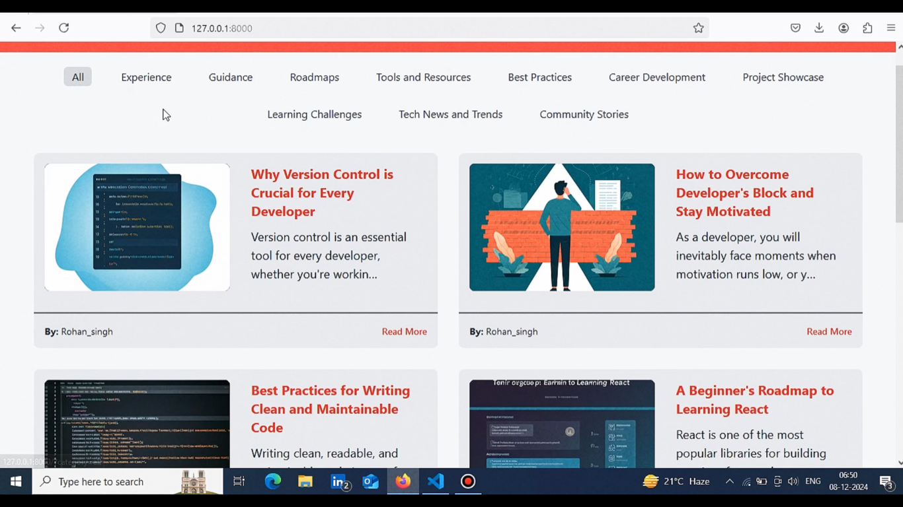

# StackJourney

**StackJourney** is a blogging platform designed for developers and tech enthusiasts to share their experiences, tips, and guidance with others. It allows users to create, read, edit, and delete posts, give thanks to others for their informative blogs, and maintain personalized profiles. Whether you're a beginner or an experienced developer, StackJourney aims to create a space for learning, sharing, and growing together.

[](https://youtu.be/7q_WaEFhV80)


## Features

- **CRUD Operations**: Users can create, read, edit, and delete blog posts.
- **User Authentication**: Sign in and log in features for users to securely access their accounts.
- **Thanks Feature**: Users can give "thanks" to posts they find helpful or informative.
- **Personalized Profiles**: Each user has a dedicated profile where they can track their posts, see how many "thanks" they’ve received, and manage their account information.

## Technologies Used

- **Django**: The backend of the project is built with Django, a high-level Python web framework that encourages rapid development and clean, pragmatic design.
- **SQLite**: The project uses SQLite as the database for storing user data and posts.
- **HTML, CSS, JavaScript**: The front-end is built using basic HTML, CSS, and JavaScript for rendering dynamic content.

## Installation and Setup

To run StackJourney on your local machine, follow these steps:

### 1. Clone the repository

```bash
git clone https://github.com/your-username/Stack-Journey.git
cd stackjourney
```

### 2. Create a virtual environment (optional but recommended)

```bash
python3 -m venv env
source env/bin/activate  # On Windows, use 'env\Scripts\activate'
```

### 3. Install the required dependencies

```bash
pip install -r requirements.txt
```

### 4. Apply database migrations

```bash
python manage.py migrate
```

### 5. Run the development server

```bash
python manage.py runserver
```

The app should now be running at `http://127.0.0.1:8000/` in your browser.

## Deployment

I am currently working on deploying StackJourney on **Render** or **PythonAnywhere**. If you have experience deploying Django projects and have any suggestions or advice, feel free to reach out!

## Contributing

If you’d like to contribute to StackJourney, feel free to open an issue or submit a pull request. Whether it’s fixing a bug, improving the codebase, or suggesting new features, all contributions are welcome!

## License

This project is open-source and available under the [MIT License](LICENSE).

---

### Contact

If you have any questions or need further assistance, feel free to contact me at [mohitr8998@gmail.com](mailto:mohitr8998@gmail.com).
